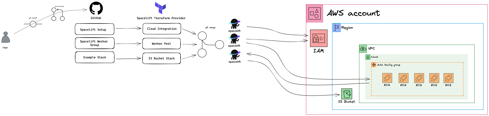

# Spacelift Example Stack

This repository contains example Terraform codes for creating a Stack for an AWS S3 Bucket from Spacelift.

You can run this Terraform code on Spacelift with creating a Stack and connecting this repository to your Spacelift.

The Terraform codes creates the following resources:

- A Stack on Spacelift
- Necessary IAM Roles
- S3 Bucket Example

